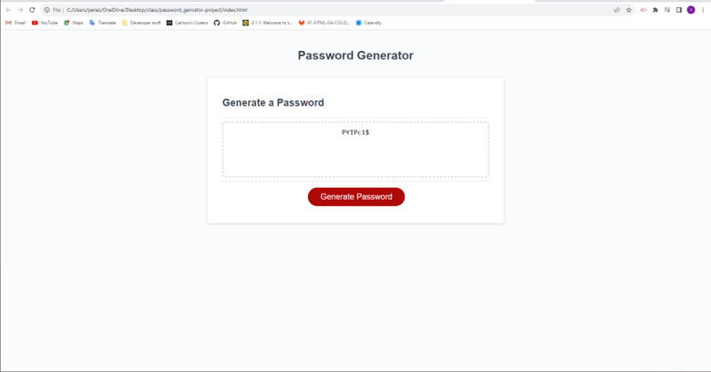

# Password Generator
App to genenrate a random password of chosen length and character content.

# Introduction
*As a user I want to use an application that will generate a random secure password.

## Features
*When the user presses the "generate password" button then then a prompt window will show.
*Users can select password length by inputting a number on the first prompt.
*Users can choose to include special characters and/or numbers in their password.

## Screenshot
![Screenshot of web application in teh browser.]

# Citations
*Github for starter code